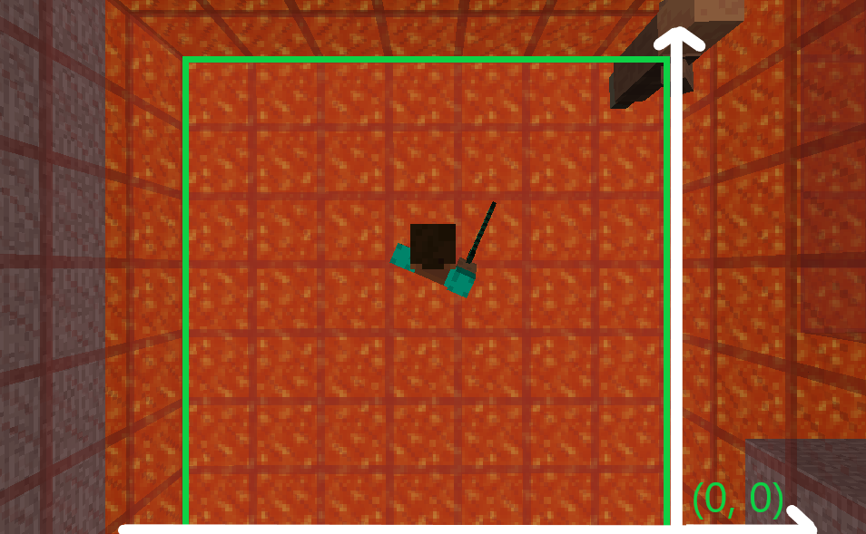
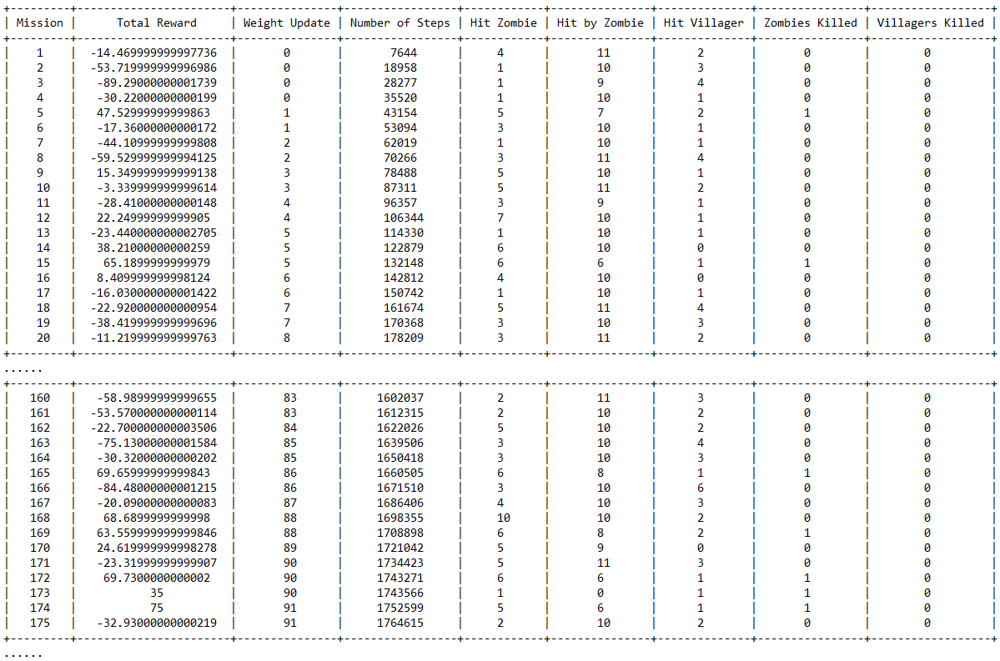
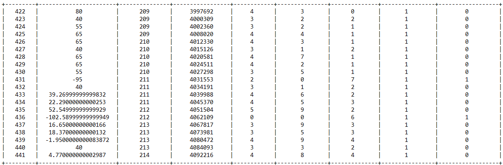

## Video Summary:

<iframe width="560" height="315" src="https://www.youtube.com/embed/XvMaX-rjyzc" frameborder="0" allow="accelerometer; autoplay; encrypted-media; gyroscope; picture-in-picture" allowfullscreen></iframe>

## Project Summary:

In this project, our goal is to let agent protect villager and kill zombie. 

We do this by using deep reinforcement learning, which is a combination of deep learning and reinforcement learning. 

The reason we choose this algorithm is - The villager and zombie are controlled by the game AI itself. Both the agent and the villager is the potential attacking target of the zombie. So how villager and zombie behave is unpredictable. Plus the possible postions of all these three units on the map could over ten thousands, the actual possible state could way more than this number. The traditional q-learning algorithm can't handle this amount of possbile state efficiently. But we know that neural network is good at processing such scale of numbers. Thus we replace the q-function with neural newtwork, and this becomes our final algorithm - deep reinforcement learning.

## Approach: 

Following is the whole process diagram of our algorithm:

<h6>Fig1. Diagram of the algorithm</h6>

#### _Algorithm:_

_To be specific, we use DQN(Deep Q-Network) as our baseline algorithm._

The key point of this algorithm is to fit the original q-value function by using a neural network, which is:

> Q(s,a,w)~q(s,a)

where Q is the neural network, w is the weight.

We actually design two ways of representing the relationship between state,action and q-values, which will make easier for us to calculate.  
They are: 
   1. Q(state) = actions,q - values 
   2. Q(state, action) = q - value 
The first one is the actions and corresponding q-values under given state, and the second one is the q-value under given state and action. 

In the original Q-Network algorithm, we use Bellman equation to iteratively updating the q-function:

> qnew(s,a)= Es’[reward+γ\*max q(s',a')| St=s, At=a]
                  
But apparently, if we already know what q(s,a) is, there is no need for us to use neural network to fit it. Plus, as a traditional machine learning algorithm, the neural network need a loss function to update the weight. _Then how do we accomplish these two missions?_  We use following:

> Loss = (reward+γ\*max Q(s',a',w')-Q(s,a,w))2

This means, we use past neural network to fit the future neural network. 
Also, if we update w every frame, the value would become very unstable. Because while Q is having a new w, Q’ is also having a new value, which the model would not be able to aim for a correct target. So we update the w every 10000 frame. This is called delayed update policy.We keep the same neural network, but we have two weights.

_Our improved algorithm is Double DQN._

Compared with DQN, Double DQN keeps the advantages of DQN and have some improvements. Technically, it's better than DQN so we don't talk about the disadvantage of Double DQN compared to DQN. 
Double DQN comes from the idea of Double Q-learning. In Double Q-learning, we construct two q-functions and update them alternately, which means if we use Q1 to choose action, we update Q2, and vice-versa. We can do the same in DQN. But we find that, since we are using delayed update policy, we aleady have two weights, we can consider them as two seperate neural network. We don't need to construct a new one.  
So the Loss function of Double DQN is the following:

> Loss = (reward+γ\*Q(s',argmax Q(s',a',w),w')-Q(s,a,w))2

We use past weight to choose action, and use this action and new state to fit future weight.  
The best improvement of Double DQN is, it elimates the overestimate. In fact, the q-value in DQN would become larger and larger eventually. By doing this in Double-DQN, the overestimate can be controlled so that the q-value won't become too large. 

#### _Input:_

Initially, the baseline for our input state would be a 5x5 map from every frame, including the position of the agent, zombie and villager. We use game API to get the yaw infomation of the agent, and we use this to calculate what angle the agent is facing at each frame, since agent need to know where is the enemy and which direction he should go. But we don't care the angle of the villager and the zombie.

Different positions of either agent, villager and zombie would be a unique position state. The total position states in 5x5 map would be 25x24x23 = 13800. While the agent have degree as direction information, the actual state would be hard to calculate. And that’s why we choose neural network to process. 

While in our final version, we make the map become 7x7.

<h6>Fig2. Structure of a single complete State</h6>

To have more details, we actually take 4 frames as a complete state. Aka, a complete state would be a 7x7x4 array. Because the difference between every frame is too small, especially the position information, any of the unit on the map may be in the same brick for 3~5 frames. So we put 4 frames together to make a status.

#### _Dealing with Data:_

In the traditional machine learning process, we shuffle the data to solve the problem of correlation. Aka, if you are doing a classification problem, it’s better to train some Class A and some Class B, instead of training the algorithm with all Class A and then all Class B.  Then we face another problem when we processing the data in DQN: There is no way for us to get future state(data) before we start training the neural network. _How do we do that?_ 
We use a experience/memory array to record all the states. We use this array to store the past state, and randomly take out some samples and feed them to the neural network to do the training.  
The real memory array would be in the form of:

> [frame, action, reward, is_terminal]

We will record every frame, its corresponding action, reward and if this frame is a terminal frame. 

Every time we need to take out the data, we randomly choose one frame. The chosen frame we call it “key frame”. The key frame will form a state (frame k-3 to frame k) and new_state(k-2 to k+1). The action will just be the action from the key frame k.

<h6>Fig3. How we choose frame </h6>

So every piece of data took out from the memory array would be in the form of: 

> [state ,action, reward, new_state, is_terminal]

We feed the neural network with a batch of above kind of data.

We also consider the storage. Our memory array have a limitation. If it’s full, the new state will replace the old ones. The reason why we doing this is the training could take a long time, and the storage of the RAM could be full. We don’t want the training stops because there is no memory on the hardware.

#### _Reward:_

We initially set 6 different situations for rewarding in total. If villager alive in every frame, we give reward 0.02. If villager died, the agent will have reward -50. If zombie died, it scores 40. If the zombie is attacked by the agent, everytime it scores 10. If agent is attacked by zombie, it scores -5. Finally if our agent died, it scores -40. 

But in the final version, we delete the reward for the alive of villager, which gets 0.02 every frame. We find that if we do this, the agent may just walk around and buy more time, which would greatly increase the total reward but not killing zombie.

#### _Action and Policy:_

_Action:_ 
We only have 5 action, which are move forward, move backward, turn left, turn right and doing nothing. We let the agent keep attacking so that it only need to consider about which way to go.

_Policy:_ 
We set three policies in our function and use parameter to choose which one we want to use.

_1. Greedy Epsilon Policy:_ 
In the baseline, the way we choose action is the Greedy Epsilon Policy. We would set the value of epsilon to be 0.05. Then we will randomly generate a number between 0-1, if the number is greater and equal than 0.05, our agent will pick the most valuable action from the q-value list. Otherwise, agent will randomly pick an action to execute. 

_2. Linear Greedy Epsilon Policy:_ 
In the final version, we improve the policy to be Linear Greedy Epsilon Policy. The reason we do this is - in fact, all the weights in the neural network are set randomly, so the "best action" it choose makes no sense at all, there is no way that we can trust our model at the begining, so there is no need for us to ask it. Just pick a random action. So at the begining, epsilon is set to 1. With the time past, epsilon would going down little by little until 0.05. By doing this, we start to give more trust to our model with the time pass by, but we still want the agent has the chance to get new/random action.

<h6>Fig4. Linear Greedy Epsilon Policy</h6>

_3. Greedy Policy_ 
This policy is totally for testing, we do not set any epsilon. After the model has been trained, we totally let the model decides the best action because we give 100 percent trust for our model.

## Evaluation:

<h6>Fig5. Initialize the arena prototype with the coordinates</h6>

_Baseline_

By setting up our initial map with a 5 x 5 (or 25 blocks) size arena, we are able to train the agent’s ability to observe its surrounding, make an action according to the constraints/score, and learn the reward/consequence of attacking a certain entity. 
In order to ensure accurate observation, it is necessary to include coordinates that locates each entity (Agent, Villager, Zombie) and differentiates their standing positions (25 blocks).
The accuracy is the number of “correct” actions that generates positive reward each mission over the total number of observations. Since our project mainly focus on the reward policy. The performance of this project is measured by how accurately our agent observes its surrounding environment. After we finish training our agent for certain number of rounds, we are able to see that our agent can identify and attack the zombie. 

There are some examples regarding our accuracy measurement.

<h6>Fig6. The agent is attacking the villager</h6>

In the picture above, the agent performed an action we don’t want. We count this as a false positive because the agent is able to learn that attacking villager will result in a negative reward. There are also cases when villagers and zombies stayed very close. By which I mean agent may accidentally attack the villager while his first intention was the zombie. 

<h6>Fig7. The villager was attacked by zombie</h6>

<h6>Fig8. Agent draws the attention of zombie</h6>

<h6>Fig9. Agent’s behavior before training</h6>

<h6>Fig10. Agent’s behavior after training</h6>

Table. 5 x 5 [one zombie/one villager] map 

 
In the second phase, we change the prototype of the matrix from containing both positive and negative coordinates to containing all positive coordinates. So that we can easily expand our map size to 7 x 7, 10 x 10 or even larger in the future without changing the core implementation of the helper functions and DQN algorithms. 
  

  
As we setting up a larger map (7 x 7 this time) in order to increase the difficulty of the game since the number of parameter doubles and the agent will need more time/rounds to learn. The data below indicates the learning progress of the agent, you can see the first column represents the total rewards received and second last column represents the number of zombies killed. In this case, a 1 would simply mean "Sucess". As the training goes on (I neglect the trivial middle training data), we can see the agent is making good progress from round 160 since the agent is able to kill the zombie more frequently than the first 20 rounds. Finally, at about 400 rounds, we can observe that the agent has made steady progress by consecutively slain the zombie.
  
Table. 7 x 7 [one zombie/one villager] map 

  
We also test it in the 10 x 10 map, the agent is able to consecutively kill the zombie at approximately 1400 round. The training took about 10 hours and the data is a lot longer, therefore it wasn't shown here.

## Resource used: 

1. [Fighting Zombies in Minecraft With Deep Reinforcement Learning](http://cs229.stanford.edu/proj2016/report/UdagawaLeeNarasimhan-FightingZombiesInMinecraftWithDeepReinforcementLearning-report.pdf) - Hiroto Udagawa, Tarun Narasimhan, Shim-Young Lee
2. [Beat Atari with Deep Reinforcement Learning!](https://becominghuman.ai/lets-build-an-atari-ai-part-1-dqn-df57e8ff3b26) - Adrien Lucas Ecoffet
3. [Playing Atari with Deep Reinforcement Learning](https://www.cs.toronto.edu/~vmnih/docs/dqn.pdf) - Volodymyr Mnih, Koray Kavukcuoglu, David Silver, Alex Graves, Ioannis Antonoglou, Daan Wierstra Martin Riedmiller
4. [Deep Reinforcement Learning with Double Q-learning](https://arxiv.org/pdf/1509.06461.pdf) - Hado van Hasselt, Arthur Guez, David Silver
5. [XML Schema Documentation](https://microsoft.github.io/malmo/0.21.0/Schemas/MissionHandlers.html)
6. [MalmoPython.AgentHost() documentation](http://microsoft.github.io/malmo/0.16.0/Documentation/classmalmo_1_1_agent_host.html)
